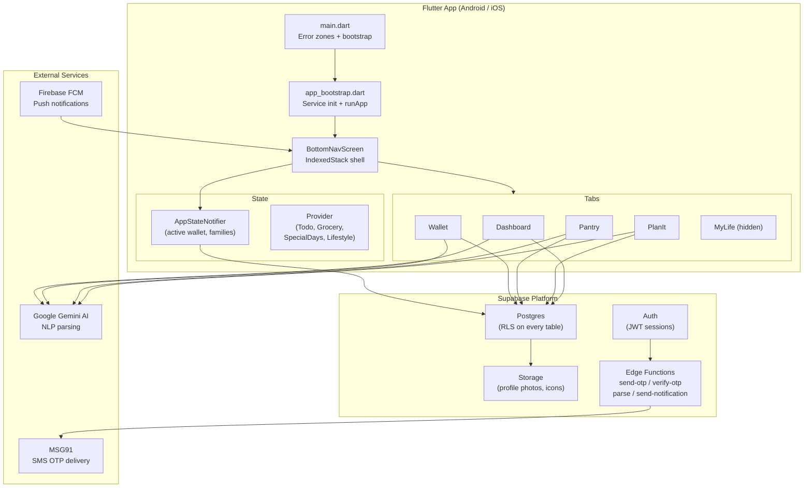

# WAI Life Assistant — Architecture Overview

> Canonical location for architecture documentation. The legacy `docs/architecture.md` (flat) is superseded by this file.

---

## Application Summary

**WAI** (*We Are Indian*) is a Flutter mobile application for Indian household management. It provides four core pillars — **finances (Wallet), food (Pantry), planning (PlanIt), and lifestyle** — under a shared family data model. Data is owned by a user but optionally shared across a *family wallet*, allowing household members to see and contribute to the same records in real time.

| Property | Value |
|---|---|
| Package name | `wai_life_assistant` |
| App version | `1.0.0+1` |
| Dart SDK | `^3.10.3` |
| Min Flutter | matches SDK `^3.10.3` |

---

## High-Level System Diagram



---

## Tech Stack

### Core Framework
| Package | Version | Purpose |
|---|---|---|
| `flutter` | SDK `^3.10.3` | UI framework |
| `provider` | `^6.0.5` | State management (ChangeNotifier) |
| `dio` | `^5.4.3` | HTTP client (REST layer + interceptors) |
| `http` | `^1.1.0` | Lightweight HTTP (edge functions) |

### Backend & Auth
| Package | Version | Purpose |
|---|---|---|
| `supabase_flutter` | `^2.0.0` | Database, auth, storage, edge functions |
| `flutter_secure_storage` | `^10.0.0` | Secure token / session storage |

### Notifications & Push
| Package | Version | Purpose |
|---|---|---|
| `firebase_core` | `^3.0.0` | Firebase initialisation |
| `firebase_messaging` | `^15.0.0` | FCM push notification delivery |
| `flutter_local_notifications` | `^18.0.1` | Local alarms and scheduled notifications |
| `timezone` | `^0.10.0` | Timezone-aware scheduling |

### Device & Platform
| Package | Version | Purpose |
|---|---|---|
| `permission_handler` | `^11.0.1` | Runtime permission requests |
| `local_auth` | `^2.3.0` | Biometric / PIN app lock |
| `image_picker` | `^1.0.7` | Camera + gallery photo selection |
| `flutter_contacts` | `^1.1.7+1` | Address book access (split participants) |
| `speech_to_text` | `^7.0.0-beta.2` | Voice input (device-native, not Cloud API) |
| `connectivity_plus` | `^6.1.4` | Online/offline detection |
| `device_info_plus` | `^10.1.0` | Device metadata for error logging |
| `flutter_sms_inbox` | `^1.0.4` | SMS reading *(disabled pending Play Store approval)* |

---

## Environment Setup

The environment is injected at **compile time** via `--dart-define`:

```bash
flutter run                        # dev (default)
flutter run --dart-define=ENV=qa
flutter run --dart-define=ENV=uat
flutter build apk --dart-define=ENV=prod
```

`EnvironmentConfig` (`lib/core/env/environment_config.dart`) maps the string to a typed config object:

| ENV value | App name | Debug banner | Logs |
|---|---|---|---|
| `dev` *(default)* | Life Assistant DEV | Shown | On |
| `qa` | Life Assistant QA | Shown | On |
| `uat` | Life Assistant UAT | Shown | On |
| `prod` | Life Assistant | Hidden | Off |

> Known gap: Supabase URL and anon key in `SupabaseConfig` are hardcoded for a single project. For true multi-environment support these should be passed via `--dart-define=SUPABASE_URL=...`.

---

## App Startup Sequence

```
main()
 │
 ├─ 1. FlutterError.onError = ErrorLogger.log(...)
 │
 └─ 2. runZonedGuarded(...)
        │
        ├─ 3. WidgetsFlutterBinding.ensureInitialized()
        │
        └─ 4. bootstrapApp(env)
               ├─ 5. Firebase.initializeApp()          ← non-fatal if unconfigured
               ├─ 6. EnvironmentConfig.fromEnv(env)    ← sets global envConfig
               ├─ 7. Supabase.initialize(url, anonKey) ← SDK ready, session restored
               ├─ 8. ErrorLogger.initialize()          ← resolves device/app metadata
               ├─ 9. NotificationService.init()        ← local alarm channels
               ├─10. FcmService.initialize()           ← FCM token + listener (non-fatal)
               ├─11. NetworkService.init()             ← connectivity stream
               │     [SMS auto-scan DISABLED]
               │
               └─12. runApp(
                       MultiProvider(
                         providers: [TodoController, GroceryController,
                                     SpecialDaysController, LifestyleController],
                         child: LifeAssistanceApp(config: envConfig),
                       )
                     )
```

Steps 5 and 10 are gracefully non-fatal — Firebase unconfigured means no push, not a crash.

---

## State Management

### Pattern A — Provider (ChangeNotifier)
Registered at app root. Used for domain-specific data that multiple screens need.

| Controller | What it owns |
|---|---|
| `TodoController` | Task list CRUD, completion state |
| `GroceryController` | Shopping basket items |
| `SpecialDaysController` | Birthdays, anniversaries, upcoming events |
| `LifestyleController` | Lifestyle module items |

### Pattern B — AppStateNotifier + AppStateScope
A custom `InheritedNotifier` — the single source of truth for wallet context.

```dart
AppStateScope.of(context).switchWallet(id);    // triggers rebuild
AppStateScope.read(context).activeWalletId;    // read without subscribing

AppStateNotifier.activeWallet     → WalletModel currently selected
AppStateNotifier.isPersonal       → bool, true when on personal wallet
AppStateNotifier.wallets          → all wallets (personal + family)
AppStateNotifier.families         → family group metadata
```

---

## Navigation Structure

```
/                  SplashScreen      ← auth gate: checks currentSession
/login             LoginScreen       ← phone number entry
/otp               OtpScreen         ← 6-digit OTP
/bottomNav         BottomNavScreen   ← main app shell (requires valid session)
```

`BottomNavScreen` → `AppShell` → `IndexedStack`:
```
AppShell (IndexedStack)
 ├── [0] DashboardScreen
 ├── [1] WalletScreen
 ├── [2] PantryScreen
 ├── [3] PlanItScreen
 └── [4] LifeStyleScreen  ← HIDDEN from nav bar (V2 feature)
```

**Deep-link navigation via FCM:** `FcmService.pendingTab` is a `ValueNotifier<int?>`. Push notification sets the tab; `AppShell._onFcmTab()` applies it.

---

## Personal vs Family Toggle

```
User taps wallet pill in any tab header
        ↓
AppStateNotifier.switchWallet(newId)
        ↓
notifyListeners() → AppStateScope rebuilds
        ↓
All screens receive new activeWalletId prop
        ↓
Each screen re-fetches data scoped to the new walletId
```

**Per-tab scope preference** (saved in `AppPrefs`):
```dart
AppPrefs.walletScope  → 'personal' | 'family'
AppPrefs.pantryScope  → 'personal' | 'family'
AppPrefs.planItScope  → 'personal' | 'family'
```

Every service method accepts `walletId` and passes it directly to Supabase. The server's RLS policies verify independently that the requesting `user_id` is a member of that wallet.

---

## Authentication Flow

OTP is handled through Supabase Edge Functions, not Supabase built-in OTP:

```
LoginScreen  →  /send-otp  →  MSG91  →  SMS delivered
                   │
              requestId returned

User enters OTP
                   │
OtpScreen  →  /verify-otp  →  validates with MSG91
                   │
              returns access_token + refresh_token
                   │
              _client.auth.setSession()
                   │
              Navigator.pushReplacementNamed('/bottomNav')
```

> Security note: `AuthCoordinator.bypassVerify()` signs in anonymously — development only, must be removed before production release.

---

## Security Model

| Layer | Mechanism | Notes |
|---|---|---|
| Transport | HTTPS (Supabase SDK) | No certificate pinning |
| Authentication | JWT via Edge Function OTP | Auto-refreshed by SDK |
| Authorisation | RLS on every table | `user_id = auth.uid()` or wallet membership |
| App lock | `AppLockGuard` — biometric/PIN | Wraps entire `AppShell` |
| Session storage | `flutter_secure_storage` | SDK manages persistence |
| Secrets | `anonKey` hardcoded | Should move to `--dart-define` |
| Dev bypass | `bypassVerify()` anonymous | Must remove before production |

**RLS policy pattern:**
```sql
-- Personal data
CREATE POLICY "own" ON some_table
  FOR ALL USING (auth.uid() = user_id);

-- Shared wallet data
CREATE POLICY "wallet_member" ON some_table
  FOR ALL USING (
    wallet_id IN (
      SELECT wallet_id FROM wallet_members WHERE user_id = auth.uid()
    )
  );
```

---

## Related Documentation

- [Database Schema](database.md) — full table reference, RLS, migration history
- [Integrations](integrations/supabase.md) — Supabase setup and configuration
- [Error Tracking](operations/error-tracking.md) — error capture sources
- [Onboarding](onboarding.md) — getting started as a new developer
