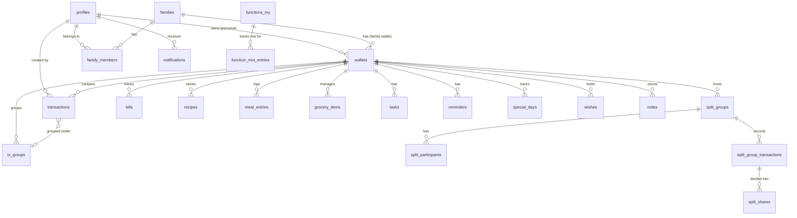

# WAI Life Assistant — Database Schema

> Canonical location for database documentation. Supersedes `docs/database_schema.md`.

---

## Overview

WAI uses a single **Supabase Postgres** database. All 41 migration files are applied sequentially (`001` → `041`), plus two seed files: `ai_prompts.sql` and `functions_ai_prompts.sql`. Every table has Row Level Security (RLS) enabled — no data is readable or writable without a valid JWT session, except `error_logs` which accepts anonymous inserts for pre-auth crash reporting.

### Shared Utility Functions

```sql
-- Created in migration 001, reused across all tables:
CREATE OR REPLACE FUNCTION update_updated_at()
RETURNS TRIGGER AS $$
BEGIN
  NEW.updated_at = NOW();
  RETURN NEW;
END;
$$ LANGUAGE plpgsql;

-- Pantry RLS shortcuts (migration 003):
wallet_accessible(wid UUID) → BOOLEAN  -- caller owns or is a family member
wallet_admin(wid UUID)      → BOOLEAN  -- caller is admin of the wallet's family
```

---

## Scope Classification

| Scope | How data is owned | Key column |
|---|---|---|
| **Personal** | Belongs to `auth.uid()` only | `user_id = auth.uid()` |
| **Wallet-scoped** | Shared across everyone in a wallet | `wallet_id` |
| **System** | Platform-level, not user-owned | service role only |

| Table | Scope |
|---|---|
| `profiles` | Personal |
| `families` | Wallet-scoped (members) |
| `family_members` | Wallet-scoped (members) |
| `wallets` | Personal or Wallet-scoped |
| `transactions` | Wallet-scoped |
| `tx_groups` | Wallet-scoped |
| `user_tx_categories` | Personal |
| `split_groups` | Wallet-scoped |
| `split_participants` | Wallet-scoped |
| `split_group_transactions` | Wallet-scoped |
| `split_shares` | Wallet-scoped |
| `split_group_messages` | Wallet-scoped |
| `bills` | Wallet-scoped |
| `recipes` | Wallet-scoped |
| `meal_entries` | Wallet-scoped |
| `meal_reactions` | Wallet-scoped |
| `grocery_items` | Wallet-scoped |
| `member_food_prefs` | Wallet-scoped |
| `tasks` | Wallet-scoped |
| `reminders` | Wallet-scoped |
| `special_days` | Wallet-scoped |
| `wishes` | Wallet-scoped |
| `notes` | Wallet-scoped |
| `functions_my` | Personal (`user_id`) |
| `functions_upcoming` | Personal (`user_id`) |
| `functions_attended` | Personal (`user_id`) |
| `function_moi_entries` | Personal (`user_id`) |
| `notifications` | Personal (`user_id`) |
| `feature_usage` | Personal (`user_id`) |
| `feature_limits` | System (read-only by all auth users) |
| `app_config` | System (read-only by all auth users) |
| `error_logs` | System (insert-only by any user) |
| `ai_prompts` | System (read by edge function) |
| `ai_parse_logs` | System (written by edge function) |

---

## Entity Relationship Diagram



---

## Table Reference

### `profiles`
*Extends `auth.users`. One row per registered user.*

```sql
CREATE TABLE profiles (
  id            UUID        PRIMARY KEY REFERENCES auth.users(id) ON DELETE CASCADE,
  name          TEXT        NOT NULL DEFAULT '',
  display_name  TEXT,
  emoji         TEXT        NOT NULL DEFAULT '👤',
  phone         TEXT        UNIQUE,
  relation_self TEXT        DEFAULT 'Self',
  onboarded     BOOLEAN     NOT NULL DEFAULT FALSE,
  dob           DATE,
  plan          TEXT,
  default_wallet_scope   TEXT,
  default_pantry_scope   TEXT,
  default_planit_scope   TEXT,
  created_at    TIMESTAMPTZ NOT NULL DEFAULT NOW(),
  updated_at    TIMESTAMPTZ NOT NULL DEFAULT NOW()
);
```

**RLS:** Owner only — `auth.uid() = id`. Auto-created by `trg_on_auth_user_created` trigger.

---

### `families`
*Named group that links members and a shared wallet.*

```sql
CREATE TABLE families (
  id           UUID        PRIMARY KEY DEFAULT gen_random_uuid(),
  name         TEXT        NOT NULL,
  emoji        TEXT        NOT NULL DEFAULT '👨‍👩‍👧',
  color_index  INTEGER     NOT NULL DEFAULT 0,
  description  TEXT,
  created_by   UUID        REFERENCES profiles(id) ON DELETE SET NULL,
  is_archived  BOOLEAN     NOT NULL DEFAULT FALSE,
  perm_invite  TEXT        NOT NULL DEFAULT 'admin_only',
  perm_edit    TEXT        NOT NULL DEFAULT 'any_member',
  perm_delete  TEXT        NOT NULL DEFAULT 'admin_only',
  created_at   TIMESTAMPTZ NOT NULL DEFAULT NOW()
);
```

**RLS:** Members can SELECT; only admins can INSERT/UPDATE.

---

### `family_members`
*Junction between a family and a user (or a named placeholder without an account).*

```sql
CREATE TABLE family_members (
  id         UUID PRIMARY KEY DEFAULT gen_random_uuid(),
  family_id  UUID NOT NULL REFERENCES families(id)  ON DELETE CASCADE,
  user_id    UUID REFERENCES profiles(id)            ON DELETE SET NULL,
  name       TEXT NOT NULL,
  emoji      TEXT NOT NULL DEFAULT '👤',
  role       TEXT NOT NULL DEFAULT 'member'
             CHECK (role IN ('admin','member','viewer')),
  relation   TEXT,
  phone      TEXT,
  created_at TIMESTAMPTZ NOT NULL DEFAULT NOW()
);
```

`user_id` is NULL for invited-but-not-registered members.

---

### `wallets`
*The central sharing unit. Either personal (owned by one user) or family (owned by a family).*

```sql
CREATE TABLE wallets (
  id             UUID    PRIMARY KEY DEFAULT gen_random_uuid(),
  owner_id       UUID    REFERENCES profiles(id)  ON DELETE CASCADE,
  family_id      UUID    REFERENCES families(id)  ON DELETE CASCADE,
  name           TEXT    NOT NULL,
  emoji          TEXT    NOT NULL DEFAULT '💰',
  is_personal    BOOLEAN NOT NULL DEFAULT TRUE,
  cash_in        NUMERIC(12,2) NOT NULL DEFAULT 0,
  cash_out       NUMERIC(12,2) NOT NULL DEFAULT 0,
  online_in      NUMERIC(12,2) NOT NULL DEFAULT 0,
  online_out     NUMERIC(12,2) NOT NULL DEFAULT 0,
  gradient_index INTEGER NOT NULL DEFAULT 0,
  created_at     TIMESTAMPTZ NOT NULL DEFAULT NOW(),
  updated_at     TIMESTAMPTZ NOT NULL DEFAULT NOW(),
  CONSTRAINT chk_wallet_owner CHECK (
    (is_personal = TRUE  AND owner_id IS NOT NULL AND family_id IS NULL) OR
    (is_personal = FALSE AND family_id IS NOT NULL AND owner_id IS NULL)
  )
);
```

Balance columns maintained by `trg_sync_wallet_balance` trigger. **View:** `wallet_summary` adds `total_in`, `total_out`, `balance`.

---

### `transactions`
*Every financial event logged against a wallet.*

```sql
CREATE TABLE transactions (
  id        UUID    PRIMARY KEY DEFAULT gen_random_uuid(),
  wallet_id UUID    NOT NULL REFERENCES wallets(id)   ON DELETE CASCADE,
  user_id   UUID    NOT NULL REFERENCES profiles(id)  ON DELETE CASCADE,
  type      TEXT    NOT NULL
            CHECK (type IN ('income','expense','split','lend','borrow','request','returned')),
  pay_mode  TEXT    CHECK (pay_mode IN ('cash','online')),
  amount    NUMERIC(12,2) NOT NULL CHECK (amount > 0),
  category  TEXT    NOT NULL,
  title     TEXT,
  note      TEXT,
  person    TEXT,
  persons   TEXT[],
  status    TEXT,
  due_date  TEXT,
  group_id  UUID REFERENCES tx_groups(id) ON DELETE SET NULL,
  date      TIMESTAMPTZ NOT NULL DEFAULT NOW(),
  created_at TIMESTAMPTZ NOT NULL DEFAULT NOW()
);
```

**Indexes:** `(wallet_id)`, `(user_id)`, `(date DESC)`, `(type)`, `(group_id)`

**Trigger:** `trg_notify_family_on_tx` — after INSERT, creates `notifications` rows for other family members.

---

### `tx_groups`
*Named master card that bundles multiple transactions (e.g. "Diwali Shopping").*

```sql
CREATE TABLE tx_groups (
  id         UUID PRIMARY KEY DEFAULT gen_random_uuid(),
  wallet_id  UUID NOT NULL REFERENCES wallets(id)  ON DELETE CASCADE,
  user_id    UUID NOT NULL REFERENCES profiles(id) ON DELETE CASCADE,
  name       TEXT NOT NULL,
  emoji      TEXT NOT NULL DEFAULT '📦',
  created_at TIMESTAMPTZ NOT NULL DEFAULT NOW()
);
```

---

### `user_tx_categories`
*Custom categories beyond the app's built-in list.*

```sql
CREATE TABLE user_tx_categories (
  id         UUID PRIMARY KEY DEFAULT gen_random_uuid(),
  user_id    UUID NOT NULL REFERENCES auth.users(id) ON DELETE CASCADE,
  name       TEXT NOT NULL,
  tx_type    TEXT NOT NULL CHECK (tx_type IN ('expense','income','transfer')),
  created_at TIMESTAMPTZ DEFAULT now(),
  UNIQUE (user_id, name, tx_type)
);
```

---

### `split_groups`
*A named group for tracking shared expenses between multiple people.*

```sql
CREATE TABLE split_groups (
  id                   UUID    PRIMARY KEY DEFAULT gen_random_uuid(),
  wallet_id            UUID    NOT NULL REFERENCES wallets(id) ON DELETE CASCADE,
  created_by           UUID    REFERENCES profiles(id) ON DELETE SET NULL,
  name                 TEXT    NOT NULL,
  emoji                TEXT    NOT NULL DEFAULT '👥',
  pinned_to_dashboard  BOOLEAN NOT NULL DEFAULT FALSE,
  created_at           TIMESTAMPTZ NOT NULL DEFAULT NOW()
);
```

---

### `split_group_transactions`
*A single expense within a split group.*

```sql
CREATE TABLE split_group_transactions (
  id            UUID          PRIMARY KEY DEFAULT gen_random_uuid(),
  group_id      UUID          NOT NULL REFERENCES split_groups(id) ON DELETE CASCADE,
  added_by_id   UUID          REFERENCES split_participants(id) ON DELETE SET NULL,
  title         TEXT          NOT NULL,
  total_amount  NUMERIC(12,2) NOT NULL CHECK (total_amount > 0),
  split_type    TEXT          NOT NULL DEFAULT 'equal'
                CHECK (split_type IN ('equal','unequal','percentage','custom')),
  note          TEXT,
  date          TIMESTAMPTZ   NOT NULL DEFAULT NOW(),
  created_at    TIMESTAMPTZ   NOT NULL DEFAULT NOW()
);
```

---

### `split_shares`
*Each participant's portion of a split transaction.*

```sql
CREATE TABLE split_shares (
  id                UUID          PRIMARY KEY DEFAULT gen_random_uuid(),
  transaction_id    UUID          NOT NULL REFERENCES split_group_transactions(id) ON DELETE CASCADE,
  participant_id    UUID          NOT NULL REFERENCES split_participants(id) ON DELETE CASCADE,
  amount            NUMERIC(12,2) NOT NULL,
  percentage        NUMERIC(5,2),
  status            TEXT          NOT NULL DEFAULT 'pending'
                    CHECK (status IN (
                      'pending','proof_submitted','settled',
                      'extension_requested','extension_granted'
                    )),
  proof_note        TEXT,
  proof_image_path  TEXT,
  proof_date        TIMESTAMPTZ,
  extension_date    TIMESTAMPTZ,
  extension_reason  TEXT,
  created_at        TIMESTAMPTZ NOT NULL DEFAULT NOW(),
  updated_at        TIMESTAMPTZ NOT NULL DEFAULT NOW()
);
```

**View:** `my_pending_splits` joins shares → transactions → groups for all unsettled amounts.

---

### `bills`
*Recurring bill / subscription tracker.*

```sql
CREATE TABLE bills (
  id             UUID    PRIMARY KEY DEFAULT gen_random_uuid(),
  wallet_id      UUID    NOT NULL REFERENCES wallets(id) ON DELETE CASCADE,
  name           TEXT    NOT NULL,
  category       TEXT    NOT NULL DEFAULT 'other'
                 CHECK (category IN (
                   'electricity','water','gas','internet','phone',
                   'insurance','school','rent','subscription','medical','emi','other'
                 )),
  amount         DECIMAL(12,2) NOT NULL DEFAULT 0,
  due_date       DATE    NOT NULL,
  repeat         TEXT    NOT NULL DEFAULT 'monthly'
                 CHECK (repeat IN ('none','daily','weekly','monthly','yearly')),
  paid           BOOLEAN NOT NULL DEFAULT FALSE,
  provider       TEXT,
  account_number TEXT,
  note           TEXT,
  history        JSONB   NOT NULL DEFAULT '[]',
  created_at     TIMESTAMPTZ NOT NULL DEFAULT NOW(),
  updated_at     TIMESTAMPTZ NOT NULL DEFAULT NOW()
);
```

---

### `recipes`
*Saved recipes in the Pantry Recipe Box.*

```sql
CREATE TABLE recipes (
  id            UUID    PRIMARY KEY DEFAULT gen_random_uuid(),
  wallet_id     UUID    NOT NULL REFERENCES wallets(id)  ON DELETE CASCADE,
  created_by    UUID    NOT NULL REFERENCES profiles(id) ON DELETE CASCADE,
  name          TEXT    NOT NULL,
  emoji         TEXT    NOT NULL DEFAULT '🍽️',
  cuisine       TEXT    NOT NULL
                CHECK (cuisine IN (
                  'indian','chinese','italian','mexican',
                  'mediterranean','thai','japanese','continental'
                )),
  suitable_for  TEXT[]  NOT NULL DEFAULT '{}',
  ingredients   TEXT[]  NOT NULL DEFAULT '{}',
  recipe_ids    TEXT[]  NOT NULL DEFAULT '{}',
  social_link   TEXT,
  note          TEXT,
  cook_time_min INTEGER CHECK (cook_time_min > 0),
  is_favourite  BOOLEAN NOT NULL DEFAULT FALSE,
  created_at    TIMESTAMPTZ NOT NULL DEFAULT NOW(),
  updated_at    TIMESTAMPTZ NOT NULL DEFAULT NOW()
);
```

---

### `meal_entries`
*Daily meal log (Meal Map tab).*

```sql
CREATE TABLE meal_entries (
  id          UUID  PRIMARY KEY DEFAULT gen_random_uuid(),
  wallet_id   UUID  NOT NULL REFERENCES wallets(id)  ON DELETE CASCADE,
  created_by  UUID  NOT NULL REFERENCES profiles(id) ON DELETE CASCADE,
  recipe_id   UUID  REFERENCES recipes(id) ON DELETE SET NULL,
  name        TEXT  NOT NULL,
  emoji       TEXT  NOT NULL DEFAULT '🍽️',
  meal_time   TEXT  NOT NULL
              CHECK (meal_time IN ('breakfast','lunch','snack','dinner')),
  date        DATE  NOT NULL,
  note        TEXT,
  status      TEXT,
  ingredients TEXT[] NOT NULL DEFAULT '{}',
  created_at  TIMESTAMPTZ NOT NULL DEFAULT NOW(),
  updated_at  TIMESTAMPTZ NOT NULL DEFAULT NOW()
);
```

**View:** `todays_meals` — joins with reactions and recipes for the current date.

---

### `grocery_items`
*Pantry inventory + shopping basket.*

```sql
CREATE TABLE grocery_items (
  id           UUID          PRIMARY KEY DEFAULT gen_random_uuid(),
  wallet_id    UUID          NOT NULL REFERENCES wallets(id)  ON DELETE CASCADE,
  created_by   UUID          NOT NULL REFERENCES profiles(id) ON DELETE CASCADE,
  name         TEXT          NOT NULL,
  category     TEXT          NOT NULL
               CHECK (category IN (
                 'vegetables','fruits','dairy','meat','grains',
                 'beverages','snacks','spices','cleaning','other'
               )),
  quantity     NUMERIC(10,3) NOT NULL DEFAULT 1 CHECK (quantity >= 0),
  unit         TEXT          NOT NULL DEFAULT 'pcs',
  in_stock     BOOLEAN       NOT NULL DEFAULT TRUE,
  to_buy       BOOLEAN       NOT NULL DEFAULT FALSE,
  expiry_date  DATE,
  note         TEXT,
  last_updated TIMESTAMPTZ   NOT NULL DEFAULT NOW(),
  created_at   TIMESTAMPTZ   NOT NULL DEFAULT NOW()
);
```

---

### `tasks`
*PlanIt My Tasks — to-do items with subtasks, priority and project tagging.*

```sql
CREATE TABLE tasks (
  id           UUID    PRIMARY KEY DEFAULT gen_random_uuid(),
  wallet_id    UUID    NOT NULL REFERENCES wallets(id) ON DELETE CASCADE,
  title        TEXT    NOT NULL,
  emoji        TEXT    NOT NULL DEFAULT '✅',
  description  TEXT,
  status       TEXT    NOT NULL DEFAULT 'todo'
               CHECK (status IN ('todo','inProgress','done')),
  priority     TEXT    NOT NULL DEFAULT 'medium'
               CHECK (priority IN ('low','medium','high','urgent')),
  due_date     DATE,
  project      TEXT,
  tags         TEXT[]  NOT NULL DEFAULT '{}',
  assigned_to  TEXT    NOT NULL DEFAULT 'me',
  subtasks     JSONB   NOT NULL DEFAULT '[]',
  created_at   TIMESTAMPTZ NOT NULL DEFAULT NOW(),
  updated_at   TIMESTAMPTZ NOT NULL DEFAULT NOW()
);
```

`subtasks` JSONB: `[{ "id": "1", "title": "Book venue", "done": false }]`

---

### `reminders`
*PlanIt Alert Me — scheduled alerts with repeat and priority.*

```sql
CREATE TABLE reminders (
  id          UUID    PRIMARY KEY DEFAULT gen_random_uuid(),
  wallet_id   UUID    NOT NULL REFERENCES wallets(id) ON DELETE CASCADE,
  title       TEXT    NOT NULL,
  emoji       TEXT    NOT NULL DEFAULT '🔔',
  due_date    DATE    NOT NULL,
  due_time    TEXT    NOT NULL DEFAULT '09:00',
  repeat      TEXT    NOT NULL DEFAULT 'none'
              CHECK (repeat IN ('none','daily','weekly','monthly','yearly')),
  priority    TEXT    NOT NULL DEFAULT 'medium'
              CHECK (priority IN ('low','medium','high','urgent')),
  assigned_to TEXT    NOT NULL DEFAULT 'me',
  snoozed     BOOLEAN NOT NULL DEFAULT FALSE,
  done        BOOLEAN NOT NULL DEFAULT FALSE,
  note        TEXT,
  created_at  TIMESTAMPTZ NOT NULL DEFAULT NOW(),
  updated_at  TIMESTAMPTZ NOT NULL DEFAULT NOW()
);
```

---

### `special_days`
*PlanIt Special Days — birthdays, anniversaries, festivals.*

```sql
CREATE TABLE special_days (
  id                 UUID    PRIMARY KEY DEFAULT gen_random_uuid(),
  wallet_id          UUID    NOT NULL REFERENCES wallets(id) ON DELETE CASCADE,
  title              TEXT    NOT NULL,
  emoji              TEXT    NOT NULL DEFAULT '📅',
  type               TEXT    NOT NULL DEFAULT 'custom'
                     CHECK (type IN (
                       'birthday','anniversary','festival','govtHoliday','holiday','custom'
                     )),
  date               DATE    NOT NULL,
  yearly_recur       BOOLEAN NOT NULL DEFAULT TRUE,
  members            TEXT[]  NOT NULL DEFAULT '{}',
  note               TEXT,
  alert_days_before  INT     NOT NULL DEFAULT 1,
  created_at         TIMESTAMPTZ NOT NULL DEFAULT NOW(),
  updated_at         TIMESTAMPTZ NOT NULL DEFAULT NOW()
);
```

---

### `wishes`
*PlanIt Wish List — savings goals with progress tracking.*

```sql
CREATE TABLE wishes (
  id               UUID    PRIMARY KEY DEFAULT gen_random_uuid(),
  wallet_id        UUID    NOT NULL REFERENCES wallets(id) ON DELETE CASCADE,
  title            TEXT    NOT NULL,
  emoji            TEXT    NOT NULL DEFAULT '🎁',
  category         TEXT    NOT NULL DEFAULT 'other'
                   CHECK (category IN (
                     'electronics','fashion','home','travel','food','experience','other'
                   )),
  priority         TEXT    NOT NULL DEFAULT 'medium',
  target_price     NUMERIC,
  saved_amount     NUMERIC NOT NULL DEFAULT 0,
  link             TEXT,
  note             TEXT,
  purchased        BOOLEAN NOT NULL DEFAULT FALSE,
  target_date      DATE,
  savings_history  JSONB   NOT NULL DEFAULT '[]',
  created_at       TIMESTAMPTZ NOT NULL DEFAULT NOW(),
  updated_at       TIMESTAMPTZ NOT NULL DEFAULT NOW()
);
```

---

### `notes`
*PlanIt Notes — sticky notes with types and pin support.*

```sql
CREATE TABLE notes (
  id         UUID    PRIMARY KEY DEFAULT gen_random_uuid(),
  wallet_id  UUID    NOT NULL REFERENCES wallets(id) ON DELETE CASCADE,
  title      TEXT    NOT NULL DEFAULT '',
  content    TEXT    NOT NULL DEFAULT '',
  color      TEXT    NOT NULL DEFAULT 'yellow',
  note_type  TEXT    NOT NULL DEFAULT 'text'
             CHECK (note_type IN ('text','list','link','secret')),
  is_pinned  BOOLEAN NOT NULL DEFAULT FALSE,
  created_at TIMESTAMPTZ NOT NULL DEFAULT NOW(),
  updated_at TIMESTAMPTZ NOT NULL DEFAULT NOW()
);
```

---

### `functions_my` / `functions_upcoming` / `functions_attended`
*Functions Tracker — three tables for hosted, planned-to-attend, and attended functions.*

- `wallet_id` is **TEXT** (not UUID) — no FK to `wallets`. Known inconsistency.
- All three tables: personal scope (`user_id = auth.uid()`).

See [features/functions.md](features/functions.md) for the full MOI system documentation.

---

### `function_moi_entries`
*Moi (monetary gifts) received or returned at a function.*

```sql
CREATE TABLE function_moi_entries (
  id                    UUID           PRIMARY KEY DEFAULT gen_random_uuid(),
  user_id               UUID           NOT NULL REFERENCES auth.users(id) ON DELETE CASCADE,
  function_id           TEXT           NOT NULL,
  wallet_id             TEXT           NOT NULL,
  person_name           TEXT           NOT NULL,
  family_name           TEXT,
  place                 TEXT,
  phone                 TEXT,
  relation              TEXT,
  amount                DECIMAL(12,2)  NOT NULL,
  kind                  TEXT           NOT NULL DEFAULT 'newMoi'
                        CHECK (kind IN ('newMoi','returnMoi')),
  notes                 TEXT,
  returned              BOOLEAN        NOT NULL DEFAULT FALSE,
  returned_amount       DECIMAL(12,2),
  returned_on           DATE,
  returned_for_function TEXT,
  created_at            TIMESTAMPTZ    NOT NULL DEFAULT NOW()
);
```

---

### `notifications`
*In-app notification feed for family transaction activity.*

Populated by the `trg_notify_family_on_tx` trigger (SECURITY DEFINER) after every `transactions` INSERT on a family wallet. RLS allows INSERT by trigger (WITH CHECK TRUE) but SELECT only by the recipient user.

---

### `feature_usage` + `feature_limits`

```sql
-- Usage counter per user per feature per month
CREATE TABLE feature_usage (
  user_id UUID NOT NULL, feature TEXT NOT NULL, month TEXT NOT NULL,
  count INTEGER DEFAULT 0,
  UNIQUE (user_id, feature, month)
);

-- Server-controlled limits (no deploy needed to change limits)
CREATE TABLE feature_limits (
  feature TEXT PRIMARY KEY, monthly_limit INTEGER NOT NULL DEFAULT 3
);
-- Seed: ('bill_scan', 3)
```

**Function:** `check_feature_limit(user_id, feature)` — atomically increments and returns `TRUE` if within limit.

---

### `app_config`

```sql
CREATE TABLE app_config (key TEXT PRIMARY KEY, value TEXT NOT NULL, updated_at TIMESTAMPTZ);
-- Seed: ('max_family_groups', '1')
```

---

### `error_logs`

*Centralised crash log. Write-only from the client.* See [operations/error-tracking.md](operations/error-tracking.md).

**RLS:** INSERT only — `user_id IS NULL OR user_id = auth.uid()`. No client SELECT.

---

### `ai_prompts` + `ai_parse_logs`

*AI prompt versioning and parse audit log.* See [ai/prompts-reference.md](ai/prompts-reference.md).

---

## Key Database Functions

| Function | Purpose |
|---|---|
| `update_updated_at()` | Trigger — sets `updated_at = NOW()` on every UPDATE |
| `handle_new_user()` | Trigger — auto-creates `profiles` row on `auth.users` INSERT |
| `bootstrap_new_user(name, emoji)` | Creates profile + personal wallet atomically |
| `create_family_with_wallet(...)` | Creates family + admin member + family wallet atomically |
| `sync_wallet_balance()` | Trigger — updates balance columns on transactions INSERT/DELETE |
| `notify_family_on_transaction()` | Trigger (SECURITY DEFINER) — inserts notifications for family members |
| `wallet_accessible(wid)` | TRUE if caller owns or is a member of the wallet |
| `wallet_admin(wid)` | TRUE if caller is admin of the wallet's family |
| `check_feature_limit(user_id, feature)` | Atomically increments usage counter |
| `dev_link_profile_by_phone(phone)` | Dev-only — should be removed before go-live |

---

## Database Views

| View | Purpose |
|---|---|
| `wallet_summary` | Adds `total_in`, `total_out`, `balance` to wallets |
| `my_pending_splits` | All unsettled split shares for the current user |
| `my_profile_with_families` | Full profile + all families as nested JSON |
| `todays_meals` | Today's meal entries with reaction counts and recipe names |
| `shopping_summary` | Grocery basket stats grouped by category |
| `allergy_alerts` | Family members with non-empty allergy lists |

---

## Known Schema Issues

| Issue | Location | Impact |
|---|---|---|
| `wallet_id TEXT` instead of `UUID` | `functions_my`, `functions_upcoming`, `functions_attended`, `function_moi_entries` | No FK enforcement |
| `function_id TEXT` instead of `UUID` | `function_moi_entries` | No referential integrity to `functions_my.id` |
| `notes` table RLS uses `family_members.wallet_id` | `013_notes.sql` | `family_members` has no `wallet_id` column — policy may silently fail |
| `dev_link_profile_by_phone` in production schema | `009_dev_link_profile.sql` | Should be dropped before go-live |

---

## Migration History

Migrations `001` → `041` in `supabase/migrations/`. Key milestones:

| Migration | Change |
|---|---|
| `001` | Wallet schema, transactions, families |
| `003` | Pantry schema (recipes, grocery_items, meal_entries) |
| `005` | Pantry notes column |
| `007` | Split groups pinned_to_dashboard |
| `009` | Dev link profile (dev only) |
| `013` | Notes table |
| `017` | functions_my.family_name |
| `021` | `returned` transaction type |
| `023` | meal_entries.status |
| `024` | meal_entries.ingredients |
| `028` | profiles.dob, profiles.plan |
| `030` | transactions.title |
| `032` | tx_groups, transactions.group_id |
| `033` | Family permission columns |
| `037` | profiles.default_*_scope columns |
| `039` | recipes.recipe_ids |
| `040` | error_logs table |
| `041` | functions_my.icon |
