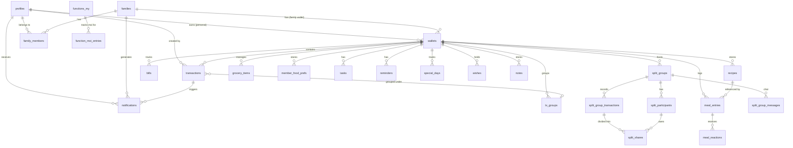

# WAI Life Assistant — Technical Documentation
### Section 2: Database Schema

---

## 2.1 Overview

WAI uses a single **Supabase Postgres** database. All 41 migration files are applied sequentially. Every table has Row Level Security (RLS) enabled — no data is readable or writable without a valid JWT session, except `error_logs` which accepts anonymous inserts for pre-auth crash reporting.

### Shared Utility

A single trigger function is created in migration `001` and reused across all tables:

```sql
CREATE OR REPLACE FUNCTION update_updated_at()
RETURNS TRIGGER AS $$
BEGIN
  NEW.updated_at = NOW();
  RETURN NEW;
END;
$$ LANGUAGE plpgsql;
```

Two helper functions (from `003_pantry_schema.sql`) are used as RLS shortcuts across Pantry tables:

```sql
-- Returns TRUE if auth.uid() owns or is a family member of the wallet
wallet_accessible(wid UUID) → BOOLEAN

-- Returns TRUE if auth.uid() is admin of the wallet's family (or personal owner)
wallet_admin(wid UUID)      → BOOLEAN
```

---

## 2.2 Scope Classification

Every table falls into one of three scope categories:

| Scope | How data is owned | Key column |
|---|---|---|
| **Personal** | Belongs to `auth.uid()` only | `user_id = auth.uid()` |
| **Wallet-scoped** | Shared across everyone in a wallet (personal or family) | `wallet_id` |
| **System** | Platform-level, not user-owned | service role only |

| Table | Scope |
|---|---|
| `profiles` | Personal |
| `families` | Wallet-scoped (members) |
| `family_members` | Wallet-scoped (members) |
| `wallets` | Personal (personal) / Wallet-scoped (family) |
| `transactions` | Wallet-scoped |
| `tx_groups` | Wallet-scoped |
| `user_tx_categories` | Personal |
| `split_groups` | Wallet-scoped |
| `split_participants` | Wallet-scoped |
| `split_group_transactions` | Wallet-scoped |
| `split_shares` | Wallet-scoped |
| `split_group_messages` | Wallet-scoped |
| `bills` | Wallet-scoped |
| `recipes` | Wallet-scoped |
| `meal_entries` | Wallet-scoped |
| `meal_reactions` | Wallet-scoped |
| `grocery_items` | Wallet-scoped |
| `member_food_prefs` | Wallet-scoped |
| `tasks` | Wallet-scoped |
| `reminders` | Wallet-scoped |
| `special_days` | Wallet-scoped |
| `wishes` | Wallet-scoped |
| `notes` | Wallet-scoped |
| `functions_my` | Personal (`user_id`) |
| `functions_upcoming` | Personal (`user_id`) |
| `functions_attended` | Personal (`user_id`) |
| `function_moi_entries` | Personal (`user_id`) |
| `notifications` | Personal (`user_id`) |
| `feature_usage` | Personal (`user_id`) |
| `feature_limits` | System (read-only by all auth users) |
| `app_config` | System (read-only by all auth users) |
| `error_logs` | System (insert-only by any user) |

---

## 2.3 Entity Relationship Diagram



---

## 2.4 Table Reference

---

### `profiles`
*Extends `auth.users`. One row per registered user.*

```sql
CREATE TABLE profiles (
  id            UUID        PRIMARY KEY REFERENCES auth.users(id) ON DELETE CASCADE,
  name          TEXT        NOT NULL DEFAULT '',
  display_name  TEXT,
  emoji         TEXT        NOT NULL DEFAULT '👤',
  phone         TEXT        UNIQUE,
  relation_self TEXT        DEFAULT 'Self',
  onboarded     BOOLEAN     NOT NULL DEFAULT FALSE,
  dob           DATE,                          -- added 028
  plan          TEXT,                          -- added 028
  default_wallet_scope   TEXT,                -- added 037
  default_pantry_scope   TEXT,                -- added 037
  default_planit_scope   TEXT,                -- added 037
  created_at    TIMESTAMPTZ NOT NULL DEFAULT NOW(),
  updated_at    TIMESTAMPTZ NOT NULL DEFAULT NOW()
);
```

| Column | Notes |
|---|---|
| `id` | Same UUID as `auth.users.id` — acts as FK |
| `onboarded` | Set to `TRUE` by `bootstrap_new_user()` after profile setup |
| `plan` | Subscription tier (e.g. `'free'`, `'pro'`) |
| `default_*_scope` | Per-tab saved scope (`'personal'`/`'family'`) |

**RLS:** Owner only — `auth.uid() = id`.

**Auto-created by trigger:** `trg_on_auth_user_created` fires after every `auth.users` INSERT and calls `handle_new_user()` to create the profile row.

**Example:**
```json
{
  "id": "a1b2c3d4-...",
  "name": "Raj Kumar",
  "emoji": "👨",
  "phone": "+919876543210",
  "onboarded": true
}
```

---

### `families`
*Named group that links members and a shared wallet.*

```sql
CREATE TABLE families (
  id           UUID        PRIMARY KEY DEFAULT gen_random_uuid(),
  name         TEXT        NOT NULL,
  emoji        TEXT        NOT NULL DEFAULT '👨‍👩‍👧',
  color_index  INTEGER     NOT NULL DEFAULT 0,
  description  TEXT,
  created_by   UUID        REFERENCES profiles(id) ON DELETE SET NULL,
  is_archived  BOOLEAN     NOT NULL DEFAULT FALSE,
  perm_invite  TEXT        NOT NULL DEFAULT 'admin_only'   -- 'admin_only'|'any_member'
               CHECK (perm_invite IN ('admin_only','any_member')),
  perm_edit    TEXT        NOT NULL DEFAULT 'any_member'
               CHECK (perm_edit   IN ('admin_only','any_member')),
  perm_delete  TEXT        NOT NULL DEFAULT 'admin_only'
               CHECK (perm_delete IN ('admin_only','any_member')),
  created_at   TIMESTAMPTZ NOT NULL DEFAULT NOW()
);
```

| Column | Notes |
|---|---|
| `color_index` | Maps to a gradient palette in the app theme |
| `perm_invite/edit/delete` | Configurable per-family permission model (migration 033) |
| `is_archived` | Soft-deleted families (excluded from `my_profile_with_families` view) |

**RLS:** Members can SELECT; only admins can INSERT/UPDATE.

**Example:**
```json
{ "id": "fam-001", "name": "Kumar Family", "emoji": "🏠", "color_index": 2 }
```

---

### `family_members`
*Junction between a family and a user (or a named placeholder without a user account).*

```sql
CREATE TABLE family_members (
  id         UUID PRIMARY KEY DEFAULT gen_random_uuid(),
  family_id  UUID NOT NULL REFERENCES families(id)  ON DELETE CASCADE,
  user_id    UUID REFERENCES profiles(id)            ON DELETE SET NULL,
  name       TEXT NOT NULL,
  emoji      TEXT NOT NULL DEFAULT '👤',
  role       TEXT NOT NULL DEFAULT 'member'
             CHECK (role IN ('admin','member','viewer')),
  relation   TEXT,
  phone      TEXT,
  created_at TIMESTAMPTZ NOT NULL DEFAULT NOW()
);
```

| Column | Notes |
|---|---|
| `user_id` | `NULL` for invited-but-not-registered members |
| `role` | `admin` = full control; `member` = read/write; `viewer` = read only |
| `relation` | Free text, e.g. `'Wife'`, `'Son'`, `'Mother'` |

**Indexes:** `(family_id)`, `(user_id)`

**RLS:** All members of the same family can view; only admins can manage.

**Example:**
```json
{ "name": "Priya Kumar", "role": "member", "relation": "Wife", "user_id": "b2c3d4..." }
```

---

### `wallets`
*The central sharing unit. Either personal (owned by one user) or family (owned by a family).*

```sql
CREATE TABLE wallets (
  id             UUID    PRIMARY KEY DEFAULT gen_random_uuid(),
  owner_id       UUID    REFERENCES profiles(id)  ON DELETE CASCADE,
  family_id      UUID    REFERENCES families(id)  ON DELETE CASCADE,
  name           TEXT    NOT NULL,
  emoji          TEXT    NOT NULL DEFAULT '💰',
  is_personal    BOOLEAN NOT NULL DEFAULT TRUE,
  cash_in        NUMERIC(12,2) NOT NULL DEFAULT 0,
  cash_out       NUMERIC(12,2) NOT NULL DEFAULT 0,
  online_in      NUMERIC(12,2) NOT NULL DEFAULT 0,
  online_out     NUMERIC(12,2) NOT NULL DEFAULT 0,
  gradient_index INTEGER NOT NULL DEFAULT 0,
  created_at     TIMESTAMPTZ NOT NULL DEFAULT NOW(),
  updated_at     TIMESTAMPTZ NOT NULL DEFAULT NOW(),
  CONSTRAINT chk_wallet_owner CHECK (
    (is_personal = TRUE  AND owner_id IS NOT NULL AND family_id IS NULL) OR
    (is_personal = FALSE AND family_id IS NOT NULL AND owner_id IS NULL)
  )
);
```

| Column | Notes |
|---|---|
| `cash_in/out`, `online_in/out` | Running totals maintained by `sync_wallet_balance()` trigger |
| `chk_wallet_owner` | Enforces XOR: a wallet is either personal (has `owner_id`) or family (has `family_id`) |

**Trigger:** `trg_sync_wallet_balance` — after INSERT/DELETE on `transactions`, updates the four balance columns atomically.

**RLS:** Personal owner gets full access; family members get SELECT; family admins get full access.

**Views:** `wallet_summary` adds computed `total_in`, `total_out`, `balance` columns.

---

### `transactions`
*Every financial event logged against a wallet.*

```sql
CREATE TABLE transactions (
  id        UUID    PRIMARY KEY DEFAULT gen_random_uuid(),
  wallet_id UUID    NOT NULL REFERENCES wallets(id)   ON DELETE CASCADE,
  user_id   UUID    NOT NULL REFERENCES profiles(id)  ON DELETE CASCADE,
  type      TEXT    NOT NULL
            CHECK (type IN ('income','expense','split','lend','borrow','request','returned')),
  pay_mode  TEXT    CHECK (pay_mode IN ('cash','online')),
  amount    NUMERIC(12,2) NOT NULL CHECK (amount > 0),
  category  TEXT    NOT NULL,
  title     TEXT,                              -- added 030
  note      TEXT,
  person    TEXT,                              -- lend/borrow/request counterparty
  persons   TEXT[],                            -- split display names
  status    TEXT,
  due_date  TEXT,
  group_id  UUID REFERENCES tx_groups(id)     ON DELETE SET NULL,  -- added 032
  date      TIMESTAMPTZ NOT NULL DEFAULT NOW(),
  created_at TIMESTAMPTZ NOT NULL DEFAULT NOW()
);
```

| Column | Notes |
|---|---|
| `type` | `returned` added in migration 021 to track lending repayments |
| `category` | Free text; user-defined categories stored in `user_tx_categories` |
| `title` | Short display title added in migration 030 |
| `group_id` | Optional grouping under a `tx_groups` master card |

**Indexes:** `(wallet_id)`, `(user_id)`, `(date DESC)`, `(type)`, `(group_id)`

**Trigger:** `trg_notify_family_on_tx` — fires AFTER INSERT, creates `notifications` rows for all other family members if the wallet is a family wallet.

**RLS:** Full access if user owns the wallet or is a family member of the wallet's family.

**Example:**
```json
{
  "type": "expense", "pay_mode": "online", "amount": 450.00,
  "category": "Groceries", "title": "BigBasket order", "note": "Weekly veggies"
}
```

---

### `tx_groups`
*Named master card that bundles multiple transactions (e.g. "Diwali Shopping").*

```sql
CREATE TABLE tx_groups (
  id         UUID PRIMARY KEY DEFAULT gen_random_uuid(),
  wallet_id  UUID NOT NULL REFERENCES wallets(id)  ON DELETE CASCADE,
  user_id    UUID NOT NULL REFERENCES profiles(id) ON DELETE CASCADE,
  name       TEXT NOT NULL,
  emoji      TEXT NOT NULL DEFAULT '📦',
  created_at TIMESTAMPTZ NOT NULL DEFAULT NOW()
);
```

**RLS:** Same wallet-access pattern as `transactions`.

---

### `user_tx_categories`
*Custom categories created by a user beyond the app's built-in list.*

```sql
CREATE TABLE user_tx_categories (
  id         UUID PRIMARY KEY DEFAULT gen_random_uuid(),
  user_id    UUID NOT NULL REFERENCES auth.users(id) ON DELETE CASCADE,
  name       TEXT NOT NULL,
  tx_type    TEXT NOT NULL CHECK (tx_type IN ('expense','income','transfer')),
  created_at TIMESTAMPTZ DEFAULT now(),
  UNIQUE (user_id, name, tx_type)
);
```

**RLS:** Personal — `user_id = auth.uid()`.

---

### `split_groups`
*A named group for tracking shared expenses between multiple people.*

```sql
CREATE TABLE split_groups (
  id                   UUID    PRIMARY KEY DEFAULT gen_random_uuid(),
  wallet_id            UUID    NOT NULL REFERENCES wallets(id) ON DELETE CASCADE,
  created_by           UUID    REFERENCES profiles(id) ON DELETE SET NULL,
  name                 TEXT    NOT NULL,
  emoji                TEXT    NOT NULL DEFAULT '👥',
  pinned_to_dashboard  BOOLEAN NOT NULL DEFAULT FALSE,   -- added 007
  created_at           TIMESTAMPTZ NOT NULL DEFAULT NOW()
);
```

**RLS:** Creator or any participant can access.

---

### `split_participants`
*Members of a split group. May or may not have a WAI account.*

```sql
CREATE TABLE split_participants (
  id         UUID    PRIMARY KEY DEFAULT gen_random_uuid(),
  group_id   UUID    NOT NULL REFERENCES split_groups(id) ON DELETE CASCADE,
  user_id    UUID    REFERENCES profiles(id) ON DELETE SET NULL,
  name       TEXT    NOT NULL,
  emoji      TEXT    NOT NULL DEFAULT '👤',
  phone      TEXT,
  is_me      BOOLEAN NOT NULL DEFAULT FALSE,
  created_at TIMESTAMPTZ NOT NULL DEFAULT NOW()
);
```

**Index:** `(group_id)`

---

### `split_group_transactions`
*A single expense within a split group (e.g. "Hotel booking ₹12,000").*

```sql
CREATE TABLE split_group_transactions (
  id            UUID          PRIMARY KEY DEFAULT gen_random_uuid(),
  group_id      UUID          NOT NULL REFERENCES split_groups(id) ON DELETE CASCADE,
  added_by_id   UUID          REFERENCES split_participants(id) ON DELETE SET NULL,
  title         TEXT          NOT NULL,
  total_amount  NUMERIC(12,2) NOT NULL CHECK (total_amount > 0),
  split_type    TEXT          NOT NULL DEFAULT 'equal'
                CHECK (split_type IN ('equal','unequal','percentage','custom')),
  note          TEXT,
  date          TIMESTAMPTZ   NOT NULL DEFAULT NOW(),
  created_at    TIMESTAMPTZ   NOT NULL DEFAULT NOW()
);
```

**Index:** `(group_id)`

---

### `split_shares`
*Each participant's portion of a split transaction, with payment proof tracking.*

```sql
CREATE TABLE split_shares (
  id                UUID          PRIMARY KEY DEFAULT gen_random_uuid(),
  transaction_id    UUID          NOT NULL REFERENCES split_group_transactions(id) ON DELETE CASCADE,
  participant_id    UUID          NOT NULL REFERENCES split_participants(id) ON DELETE CASCADE,
  amount            NUMERIC(12,2) NOT NULL,
  percentage        NUMERIC(5,2),
  status            TEXT          NOT NULL DEFAULT 'pending'
                    CHECK (status IN (
                      'pending','proof_submitted','settled',
                      'extension_requested','extension_granted'
                    )),
  proof_note        TEXT,
  proof_image_path  TEXT,
  proof_date        TIMESTAMPTZ,
  extension_date    TIMESTAMPTZ,
  extension_reason  TEXT,
  created_at        TIMESTAMPTZ NOT NULL DEFAULT NOW(),
  updated_at        TIMESTAMPTZ NOT NULL DEFAULT NOW()
);
```

**Index:** `(transaction_id)`

**View:** `my_pending_splits` joins shares → transactions → groups to show all unsettled amounts for the current user.

---

### `split_group_messages`
*In-group chat for split groups. Also used for system event messages.*

```sql
CREATE TABLE split_group_messages (
  id            UUID PRIMARY KEY DEFAULT gen_random_uuid(),
  group_id      UUID NOT NULL REFERENCES split_groups(id) ON DELETE CASCADE,
  sender_id     UUID REFERENCES split_participants(id) ON DELETE SET NULL,
  sender_name   TEXT NOT NULL,
  sender_emoji  TEXT NOT NULL DEFAULT '👤',
  text          TEXT NOT NULL,
  type          TEXT NOT NULL DEFAULT 'text'
                CHECK (type IN (
                  'text','tx_added','settled',
                  'extension_req','extension_granted','reminder'
                )),
  created_at    TIMESTAMPTZ NOT NULL DEFAULT NOW()
);
```

**Index:** `(group_id)`

---

### `bills`
*Recurring bill / subscription tracker.*

```sql
CREATE TABLE bills (
  id             UUID    PRIMARY KEY DEFAULT gen_random_uuid(),
  wallet_id      UUID    NOT NULL REFERENCES wallets(id) ON DELETE CASCADE,
  name           TEXT    NOT NULL,
  category       TEXT    NOT NULL DEFAULT 'other'
                 CHECK (category IN (
                   'electricity','water','gas','internet','phone',
                   'insurance','school','rent','subscription','medical','emi','other'
                 )),
  amount         DECIMAL(12,2) NOT NULL DEFAULT 0,
  due_date       DATE    NOT NULL,
  repeat         TEXT    NOT NULL DEFAULT 'monthly'
                 CHECK (repeat IN ('none','daily','weekly','monthly','yearly')),
  paid           BOOLEAN NOT NULL DEFAULT FALSE,
  provider       TEXT,
  account_number TEXT,
  note           TEXT,
  history        JSONB   NOT NULL DEFAULT '[]',
  created_at     TIMESTAMPTZ NOT NULL DEFAULT NOW(),
  updated_at     TIMESTAMPTZ NOT NULL DEFAULT NOW()
);
```

**RLS:** Wallet-access pattern (owner or family member).

**Example:**
```json
{
  "name": "Airtel Broadband", "category": "internet",
  "amount": 999.00, "due_date": "2026-05-10", "repeat": "monthly"
}
```

---

### `recipes`
*Saved recipes in the Pantry Recipe Box.*

```sql
CREATE TABLE recipes (
  id            UUID    PRIMARY KEY DEFAULT gen_random_uuid(),
  wallet_id     UUID    NOT NULL REFERENCES wallets(id)  ON DELETE CASCADE,
  created_by    UUID    NOT NULL REFERENCES profiles(id) ON DELETE CASCADE,
  name          TEXT    NOT NULL,
  emoji         TEXT    NOT NULL DEFAULT '🍽️',
  cuisine       TEXT    NOT NULL
                CHECK (cuisine IN (
                  'indian','chinese','italian','mexican',
                  'mediterranean','thai','japanese','continental'
                )),
  suitable_for  TEXT[]  NOT NULL DEFAULT '{}',
  ingredients   TEXT[]  NOT NULL DEFAULT '{}',
  recipe_ids    TEXT[]  NOT NULL DEFAULT '{}',   -- added 039 (linked recipe IDs)
  social_link   TEXT,
  note          TEXT,
  cook_time_min INTEGER CHECK (cook_time_min > 0),
  is_favourite  BOOLEAN NOT NULL DEFAULT FALSE,
  created_at    TIMESTAMPTZ NOT NULL DEFAULT NOW(),
  updated_at    TIMESTAMPTZ NOT NULL DEFAULT NOW()
);
```

**Indexes:** `(wallet_id)`, `(cuisine)`, `(wallet_id, is_favourite)`

---

### `meal_entries`
*Daily meal log (Meal Map tab).*

```sql
CREATE TABLE meal_entries (
  id          UUID  PRIMARY KEY DEFAULT gen_random_uuid(),
  wallet_id   UUID  NOT NULL REFERENCES wallets(id)  ON DELETE CASCADE,
  created_by  UUID  NOT NULL REFERENCES profiles(id) ON DELETE CASCADE,
  recipe_id   UUID  REFERENCES recipes(id) ON DELETE SET NULL,
  name        TEXT  NOT NULL,
  emoji       TEXT  NOT NULL DEFAULT '🍽️',
  meal_time   TEXT  NOT NULL
              CHECK (meal_time IN ('breakfast','lunch','snack','dinner')),
  date        DATE  NOT NULL,
  note        TEXT,
  status      TEXT,                    -- added 023 (e.g. 'planned','cooked','skipped')
  ingredients TEXT[] NOT NULL DEFAULT '{}',   -- added 024
  created_at  TIMESTAMPTZ NOT NULL DEFAULT NOW(),
  updated_at  TIMESTAMPTZ NOT NULL DEFAULT NOW()
);
```

**Indexes:** `(wallet_id)`, `(wallet_id, date DESC)`, `(recipe_id)`

**View:** `todays_meals` — joins with reactions and recipes for the current date.

---

### `meal_reactions`
*Family emoji reactions + comments on a meal entry.*

```sql
CREATE TABLE meal_reactions (
  id             UUID PRIMARY KEY DEFAULT gen_random_uuid(),
  meal_id        UUID NOT NULL REFERENCES meal_entries(id) ON DELETE CASCADE,
  user_id        UUID REFERENCES profiles(id) ON DELETE SET NULL,
  member_name    TEXT NOT NULL,
  reaction_emoji TEXT NOT NULL,
  comment        TEXT,
  reply_to       TEXT,
  created_at     TIMESTAMPTZ NOT NULL DEFAULT NOW(),
  updated_at     TIMESTAMPTZ NOT NULL DEFAULT NOW()
);
```

**Indexes:** `(meal_id)`, `(user_id)`

---

### `grocery_items`
*Pantry inventory + shopping basket.*

```sql
CREATE TABLE grocery_items (
  id           UUID          PRIMARY KEY DEFAULT gen_random_uuid(),
  wallet_id    UUID          NOT NULL REFERENCES wallets(id)  ON DELETE CASCADE,
  created_by   UUID          NOT NULL REFERENCES profiles(id) ON DELETE CASCADE,
  name         TEXT          NOT NULL,
  category     TEXT          NOT NULL
               CHECK (category IN (
                 'vegetables','fruits','dairy','meat','grains',
                 'beverages','snacks','spices','cleaning','other'
               )),
  quantity     NUMERIC(10,3) NOT NULL DEFAULT 1 CHECK (quantity >= 0),
  unit         TEXT          NOT NULL DEFAULT 'pcs',
  in_stock     BOOLEAN       NOT NULL DEFAULT TRUE,
  to_buy       BOOLEAN       NOT NULL DEFAULT FALSE,
  expiry_date  DATE,
  note         TEXT,                      -- added 005
  last_updated TIMESTAMPTZ   NOT NULL DEFAULT NOW(),
  created_at   TIMESTAMPTZ   NOT NULL DEFAULT NOW()
);
```

**Indexes:** `(wallet_id)`, `(wallet_id, category)`, `(wallet_id, to_buy)`, `(expiry_date) WHERE expiry_date IS NOT NULL`

---

### `member_food_prefs`
*Per-family-member dietary preferences, allergies and likes/dislikes.*

```sql
CREATE TABLE member_food_prefs (
  id              UUID    PRIMARY KEY DEFAULT gen_random_uuid(),
  wallet_id       UUID    NOT NULL REFERENCES wallets(id)  ON DELETE CASCADE,
  created_by      UUID    NOT NULL REFERENCES profiles(id) ON DELETE CASCADE,
  member_id       TEXT    NOT NULL,
  member_name     TEXT    NOT NULL,
  member_emoji    TEXT    NOT NULL DEFAULT '👤',
  allergies       TEXT[]  NOT NULL DEFAULT '{}',
  likes           TEXT[]  NOT NULL DEFAULT '{}',
  dislikes        TEXT[]  NOT NULL DEFAULT '{}',
  mandatory_foods TEXT[]  NOT NULL DEFAULT '{}',
  created_at      TIMESTAMPTZ NOT NULL DEFAULT NOW(),
  updated_at      TIMESTAMPTZ NOT NULL DEFAULT NOW(),
  UNIQUE (wallet_id, member_id)
);
```

**Index:** `(wallet_id)`

**View:** `allergy_alerts` — returns members with non-empty allergy arrays for meal planning warnings.

---

### `tasks`
*PlanIt My Tasks — to-do items with subtasks, priority and project tagging.*

```sql
CREATE TABLE tasks (
  id           UUID    PRIMARY KEY DEFAULT gen_random_uuid(),
  wallet_id    UUID    NOT NULL REFERENCES wallets(id) ON DELETE CASCADE,
  title        TEXT    NOT NULL,
  emoji        TEXT    NOT NULL DEFAULT '✅',
  description  TEXT,
  status       TEXT    NOT NULL DEFAULT 'todo'
               CHECK (status IN ('todo','inProgress','done')),
  priority     TEXT    NOT NULL DEFAULT 'medium'
               CHECK (priority IN ('low','medium','high','urgent')),
  due_date     DATE,
  project      TEXT,
  tags         TEXT[]  NOT NULL DEFAULT '{}',
  assigned_to  TEXT    NOT NULL DEFAULT 'me',
  subtasks     JSONB   NOT NULL DEFAULT '[]',
  created_at   TIMESTAMPTZ NOT NULL DEFAULT NOW(),
  updated_at   TIMESTAMPTZ NOT NULL DEFAULT NOW()
);
```

**Indexes:** `(wallet_id)`, `(status)`

**`subtasks` JSONB shape:**
```json
[{ "id": "1", "title": "Book venue", "done": false }]
```

---

### `reminders`
*PlanIt Alert Me — scheduled alerts with repeat and priority.*

```sql
CREATE TABLE reminders (
  id          UUID    PRIMARY KEY DEFAULT gen_random_uuid(),
  wallet_id   UUID    NOT NULL REFERENCES wallets(id) ON DELETE CASCADE,
  title       TEXT    NOT NULL,
  emoji       TEXT    NOT NULL DEFAULT '🔔',
  due_date    DATE    NOT NULL,
  due_time    TEXT    NOT NULL DEFAULT '09:00',
  repeat      TEXT    NOT NULL DEFAULT 'none'
              CHECK (repeat IN ('none','daily','weekly','monthly','yearly')),
  priority    TEXT    NOT NULL DEFAULT 'medium'
              CHECK (priority IN ('low','medium','high','urgent')),
  assigned_to TEXT    NOT NULL DEFAULT 'me',
  snoozed     BOOLEAN NOT NULL DEFAULT FALSE,
  done        BOOLEAN NOT NULL DEFAULT FALSE,
  note        TEXT,
  created_at  TIMESTAMPTZ NOT NULL DEFAULT NOW(),
  updated_at  TIMESTAMPTZ NOT NULL DEFAULT NOW()
);
```

---

### `special_days`
*PlanIt Special Days — birthdays, anniversaries, festivals with yearly recurrence.*

```sql
CREATE TABLE special_days (
  id                 UUID    PRIMARY KEY DEFAULT gen_random_uuid(),
  wallet_id          UUID    NOT NULL REFERENCES wallets(id) ON DELETE CASCADE,
  title              TEXT    NOT NULL,
  emoji              TEXT    NOT NULL DEFAULT '📅',
  type               TEXT    NOT NULL DEFAULT 'custom'
                     CHECK (type IN (
                       'birthday','anniversary','festival','govtHoliday','holiday','custom'
                     )),
  date               DATE    NOT NULL,
  yearly_recur       BOOLEAN NOT NULL DEFAULT TRUE,
  members            TEXT[]  NOT NULL DEFAULT '{}',
  note               TEXT,
  alert_days_before  INT     NOT NULL DEFAULT 1,
  created_at         TIMESTAMPTZ NOT NULL DEFAULT NOW(),
  updated_at         TIMESTAMPTZ NOT NULL DEFAULT NOW()
);
```

**Indexes:** `(wallet_id)`, `(date)`

---

### `wishes`
*PlanIt Wish List — savings goals with progress tracking.*

```sql
CREATE TABLE wishes (
  id               UUID    PRIMARY KEY DEFAULT gen_random_uuid(),
  wallet_id        UUID    NOT NULL REFERENCES wallets(id) ON DELETE CASCADE,
  title            TEXT    NOT NULL,
  emoji            TEXT    NOT NULL DEFAULT '🎁',
  category         TEXT    NOT NULL DEFAULT 'other'
                   CHECK (category IN (
                     'electronics','fashion','home','travel','food','experience','other'
                   )),
  priority         TEXT    NOT NULL DEFAULT 'medium'
                   CHECK (priority IN ('low','medium','high','urgent')),
  target_price     NUMERIC,
  saved_amount     NUMERIC NOT NULL DEFAULT 0,
  link             TEXT,
  note             TEXT,
  purchased        BOOLEAN NOT NULL DEFAULT FALSE,
  target_date      DATE,
  savings_history  JSONB   NOT NULL DEFAULT '[]',
  created_at       TIMESTAMPTZ NOT NULL DEFAULT NOW(),
  updated_at       TIMESTAMPTZ NOT NULL DEFAULT NOW()
);
```

**`savings_history` JSONB shape:**
```json
[{ "date": "2026-04-01", "amount": 5000, "note": "Monthly saving" }]
```

---

### `notes`
*PlanIt Notes — sticky notes with types and pin support.*

```sql
CREATE TABLE notes (
  id         UUID    PRIMARY KEY DEFAULT gen_random_uuid(),
  wallet_id  UUID    NOT NULL REFERENCES wallets(id) ON DELETE CASCADE,
  title      TEXT    NOT NULL DEFAULT '',
  content    TEXT    NOT NULL DEFAULT '',
  color      TEXT    NOT NULL DEFAULT 'yellow',
  note_type  TEXT    NOT NULL DEFAULT 'text'
             CHECK (note_type IN ('text','list','link','secret')),
  is_pinned  BOOLEAN NOT NULL DEFAULT FALSE,
  created_at TIMESTAMPTZ NOT NULL DEFAULT NOW(),
  updated_at TIMESTAMPTZ NOT NULL DEFAULT NOW()
);
```

**Indexes:** `(wallet_id)`, `(wallet_id, is_pinned)`

---

### `functions_my`
*Lifestyle → Functions tracker — functions the user is hosting.*

```sql
CREATE TABLE functions_my (
  id            UUID  PRIMARY KEY DEFAULT gen_random_uuid(),
  wallet_id     TEXT  NOT NULL,
  user_id       UUID  NOT NULL REFERENCES auth.users(id) ON DELETE CASCADE,
  type          TEXT  NOT NULL DEFAULT 'other',
  title         TEXT  NOT NULL,
  who_function  TEXT  NOT NULL DEFAULT '',
  custom_type   TEXT,
  function_date DATE,
  venue         TEXT,
  address       TEXT,
  notes         TEXT,
  family_name   TEXT,                -- added 017
  icon          TEXT  NOT NULL DEFAULT '🎊',   -- added 041
  created_at    TIMESTAMPTZ NOT NULL DEFAULT NOW(),
  updated_at    TIMESTAMPTZ NOT NULL DEFAULT NOW()
);
```

**RLS:** Personal — `user_id = auth.uid()`.

> Note: `wallet_id` is `TEXT` (not `UUID`) in this table — it stores the wallet ID string but does not enforce a FK to `wallets`. This is a known inconsistency.

---

### `functions_upcoming`
*Functions the user plans to attend.*

```sql
CREATE TABLE functions_upcoming (
  id             UUID  PRIMARY KEY DEFAULT gen_random_uuid(),
  wallet_id      TEXT  NOT NULL,
  user_id        UUID  NOT NULL REFERENCES auth.users(id) ON DELETE CASCADE,
  type           TEXT  NOT NULL DEFAULT 'other',
  person_name    TEXT  NOT NULL DEFAULT '',
  function_title TEXT  NOT NULL,
  date           DATE,
  venue          TEXT,
  notes          TEXT,
  planned_gifts  JSONB NOT NULL DEFAULT '[]',
  created_at     TIMESTAMPTZ NOT NULL DEFAULT NOW(),
  updated_at     TIMESTAMPTZ NOT NULL DEFAULT NOW()
);
```

---

### `functions_attended`
*Functions the user has already attended.*

```sql
CREATE TABLE functions_attended (
  id            UUID  PRIMARY KEY DEFAULT gen_random_uuid(),
  wallet_id     TEXT  NOT NULL,
  user_id       UUID  NOT NULL REFERENCES auth.users(id) ON DELETE CASCADE,
  type          TEXT  NOT NULL DEFAULT 'other',
  function_name TEXT  NOT NULL,
  date          DATE,
  venue         TEXT,
  notes         TEXT,
  gifts         JSONB NOT NULL DEFAULT '[]',
  created_at    TIMESTAMPTZ NOT NULL DEFAULT NOW(),
  updated_at    TIMESTAMPTZ NOT NULL DEFAULT NOW()
);
```

---

### `function_moi_entries`
*Moi (monetary gifts) received or returned at a function.*

```sql
CREATE TABLE function_moi_entries (
  id                    UUID           PRIMARY KEY DEFAULT gen_random_uuid(),
  user_id               UUID           NOT NULL REFERENCES auth.users(id) ON DELETE CASCADE,
  function_id           TEXT           NOT NULL,
  wallet_id             TEXT           NOT NULL,
  person_name           TEXT           NOT NULL,
  family_name           TEXT,
  place                 TEXT,
  phone                 TEXT,
  relation              TEXT,
  amount                DECIMAL(12,2)  NOT NULL,
  kind                  TEXT           NOT NULL DEFAULT 'newMoi'
                        CHECK (kind IN ('newMoi','returnMoi')),
  notes                 TEXT,
  returned              BOOLEAN        NOT NULL DEFAULT FALSE,
  returned_amount       DECIMAL(12,2),
  returned_on           DATE,
  returned_for_function TEXT,
  created_at            TIMESTAMPTZ    NOT NULL DEFAULT NOW()
);
```

**RLS:** Personal — `user_id = auth.uid()`.

**Example:**
```json
{
  "person_name": "Senthil Raj", "family_name": "Murugan",
  "relation": "Uncle", "amount": 5000.00, "kind": "newMoi",
  "place": "Chennai"
}
```

---

### `notifications`
*In-app notification feed for family transaction activity.*

```sql
CREATE TABLE notifications (
  id          UUID    PRIMARY KEY DEFAULT gen_random_uuid(),
  user_id     UUID    NOT NULL REFERENCES profiles(id) ON DELETE CASCADE,
  family_id   UUID    NOT NULL REFERENCES families(id) ON DELETE CASCADE,
  tx_id       UUID    REFERENCES transactions(id) ON DELETE SET NULL,
  actor_id    UUID    REFERENCES profiles(id)     ON DELETE SET NULL,
  actor_name  TEXT    NOT NULL DEFAULT '',
  actor_emoji TEXT    NOT NULL DEFAULT '👤',
  tx_type     TEXT    NOT NULL DEFAULT '',
  tx_category TEXT    NOT NULL DEFAULT '',
  tx_amount   NUMERIC(12,2) NOT NULL DEFAULT 0,
  tx_title    TEXT,
  is_read     BOOLEAN NOT NULL DEFAULT FALSE,
  created_at  TIMESTAMPTZ NOT NULL DEFAULT NOW()
);
```

**Indexes:** `(user_id, created_at DESC)`, `(family_id)`, partial `(user_id, is_read) WHERE is_read = FALSE`

**Populated by:** `trg_notify_family_on_tx` trigger (SECURITY DEFINER) that fires after every `transactions` INSERT on a family wallet.

**RLS:**
- `SELECT` — own rows only (`user_id = auth.uid()`)
- `UPDATE` — own rows only (for marking read)
- `INSERT` — `WITH CHECK (TRUE)` — allows the trigger function to write notifications for other users

---

### `feature_usage`
*Monthly scan/action counter per user per feature (enforces free-tier limits).*

```sql
CREATE TABLE feature_usage (
  id      UUID    PRIMARY KEY DEFAULT gen_random_uuid(),
  user_id UUID    REFERENCES auth.users(id) ON DELETE CASCADE,
  feature TEXT    NOT NULL,
  month   TEXT    NOT NULL,   -- format: 'YYYY-MM'
  count   INTEGER DEFAULT 0,
  UNIQUE (user_id, feature, month)
);
```

**RLS:** Personal — `user_id = auth.uid()`.

**Function:** `check_feature_limit(user_id, feature)` — atomically increments count and returns `TRUE` if still within the configured limit.

---

### `feature_limits`
*Server-controlled monthly limits per feature (admin-managed, no deploy needed to change).*

```sql
CREATE TABLE feature_limits (
  feature        TEXT    PRIMARY KEY,
  monthly_limit  INTEGER NOT NULL DEFAULT 3,
  notes          TEXT
);

-- Seed data:
INSERT INTO feature_limits VALUES ('bill_scan', 3, 'Free tier: 3 bill scans per month');
```

**RLS:** Any authenticated user can SELECT (limits are not sensitive).

---

### `app_config`
*Key-value store for server-controlled app configuration.*

```sql
CREATE TABLE app_config (
  key        TEXT PRIMARY KEY,
  value      TEXT NOT NULL,
  updated_at TIMESTAMPTZ DEFAULT NOW()
);

-- Seed data:
INSERT INTO app_config VALUES ('max_family_groups', '1', NOW());
```

**RLS:** Any authenticated user can SELECT. Currently controls `max_family_groups` (the number of family wallets a user can create — V1 default: 1).

---

### `error_logs`
*Centralised crash and error log. Write-only from the client side.*

```sql
CREATE TABLE error_logs (
  id            UUID  PRIMARY KEY DEFAULT gen_random_uuid(),
  error_type    TEXT  NOT NULL,
  error_message TEXT  NOT NULL,
  stack_trace   TEXT,
  screen_name   TEXT,
  feature       TEXT,
  action        TEXT,
  severity      TEXT  DEFAULT 'error',    -- 'critical'|'error'|'warning'|'info'
  user_id       UUID  REFERENCES auth.users(id) ON DELETE SET NULL,
  family_id     UUID,
  app_scope     TEXT,
  device_os     TEXT,
  os_version    TEXT,
  device_model  TEXT,
  app_version   TEXT,
  build_number  TEXT,
  extra_data    JSONB,
  status        TEXT  DEFAULT 'new',      -- 'new'|'reviewed'|'fixed'|'ignored'
  was_online    BOOLEAN DEFAULT TRUE,
  created_at    TIMESTAMPTZ DEFAULT NOW()
);
```

**Indexes:** `(severity, created_at DESC)`, `(status, created_at DESC)`, `(user_id, created_at DESC)`, `(feature, created_at DESC)`, `(created_at DESC)`

**RLS:** INSERT only — `user_id IS NULL OR user_id = auth.uid()`. No client SELECT — only service-role / dashboard reads.

---

## 2.5 Key Database Functions

| Function | Purpose |
|---|---|
| `update_updated_at()` | Trigger function — sets `updated_at = NOW()` on every UPDATE |
| `handle_new_user()` | Trigger — auto-creates `profiles` row on `auth.users` INSERT |
| `bootstrap_new_user(name, emoji)` | Creates profile + personal wallet atomically on first login |
| `create_family_with_wallet(name, emoji, …)` | Creates family + admin member + family wallet atomically |
| `update_family(family_id, …)` | Updates family and keeps wallet name/emoji in sync |
| `delete_family(family_id)` | Admin-only family delete (cascades to wallet, transactions) |
| `sync_wallet_balance()` | Trigger — updates `cash_in/out/online_in/out` on transactions INSERT/DELETE |
| `notify_family_on_transaction()` | Trigger (SECURITY DEFINER) — inserts notifications for family members |
| `wallet_accessible(wid)` | Helper — TRUE if caller owns or is a member of the wallet |
| `wallet_admin(wid)` | Helper — TRUE if caller is admin of the wallet's family |
| `check_feature_limit(user_id, feature)` | Atomically increments usage counter, returns TRUE if within limit |
| `dev_link_profile_by_phone(phone)` | Dev-only — migrates all data from old anonymous session to new phone user |

---

## 2.6 Database Views

| View | Purpose |
|---|---|
| `wallet_summary` | Adds `total_in`, `total_out`, `balance` to wallets |
| `my_pending_splits` | All unsettled split shares for the current user |
| `my_profile_with_families` | Full profile + all families as nested JSON (used by wallet switcher) |
| `todays_meals` | Today's meal entries with reaction counts and recipe names |
| `shopping_summary` | Grocery basket stats grouped by category |
| `allergy_alerts` | Family members with non-empty allergy lists |

---

## 2.7 Known Schema Issues

| Issue | Location | Impact |
|---|---|---|
| `wallet_id TEXT` instead of `UUID` | `functions_my`, `functions_upcoming`, `functions_attended`, `function_moi_entries` | No FK enforcement — a bad wallet ID won't be caught at DB level |
| `function_id TEXT` instead of `UUID` | `function_moi_entries` | Same — no referential integrity to `functions_my.id` |
| `notes` table RLS uses `family_members.wallet_id` | `013_notes.sql` | `family_members` table has no `wallet_id` column — this policy may silently fail |
| No index on `transactions(wallet_id, date)` composite | `001_wallet_schema.sql` | Separate indexes exist but a composite would be more efficient for the common timeline query |
| `dev_link_profile_by_phone` function in production schema | `009_dev_link_profile.sql` | Should be dropped or access-restricted before go-live |

---

*Next: **Section 3 — Feature Documentation***
